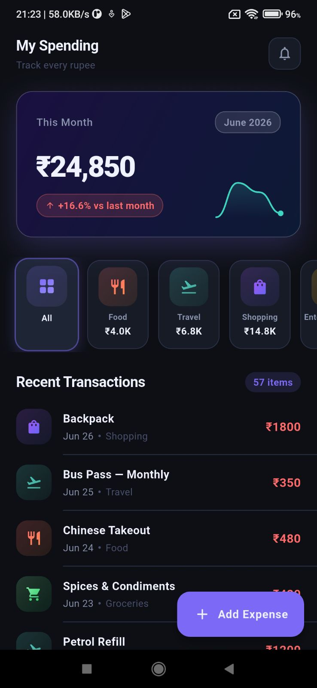
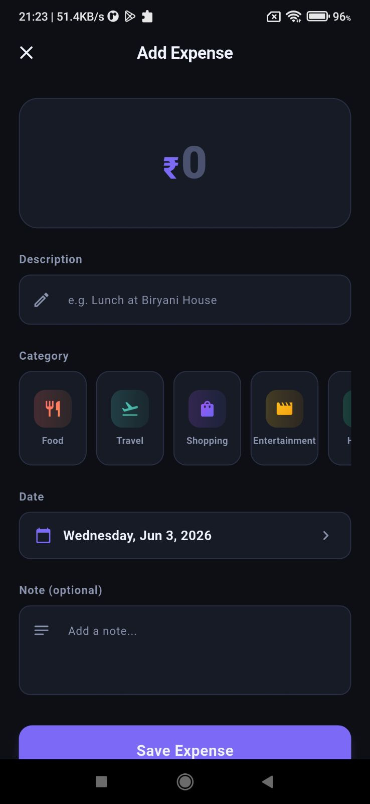
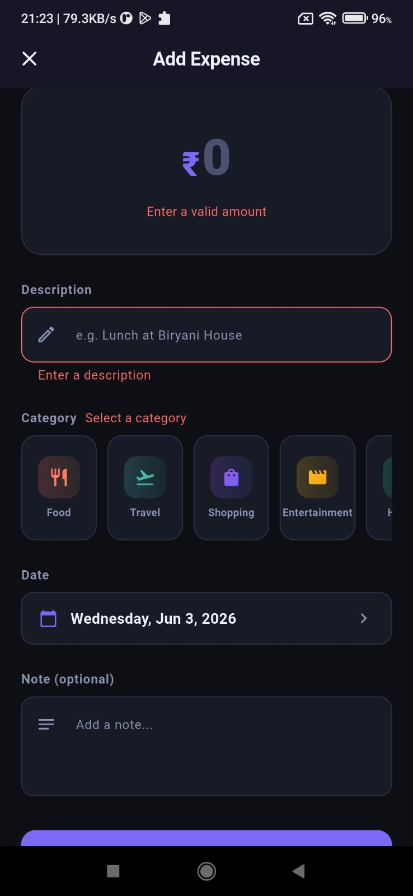

# Spend Tracker

A personal finance app to track your daily spending, built with Flutter and following Clean Architecture principles.

## Summary

Spend Tracker gives you a clear picture of where your money goes each month. The app features a real-time spending summary with animated totals and a sparkline chart showing weekly trends, a horizontal category scroll (Food, Travel, Shopping, and 5 more) with gradient icons and per-category totals, and a scrollable list of recent transactions. You can add new expenses through a dedicated form with category selection, date picker, and notes. The app uses BLoC for state management, Clean Architecture with a feature-first folder structure, and smooth entrance animations throughout.

---

## Demo


---

## Screenshots

| Spend Summary | Add Expense | Validation |
|:---:|:---:|:---:|
|  |  |  |
| Monthly total (₹24,850), sparkline trend, category filter, and transactions list | Expense form with amount, description, category picker, date, and notes | Inline validation — amount, description, and category errors shown in real time |

---

## Flutter Version

| Tool | Version |
|------|---------|
| Flutter | 3.35.7 (stable) |
| Dart | ^3.9.2 |
| Platform | iOS & Android |

---

## Getting Started

### Prerequisites

- Flutter SDK 3.35.7+ ([install guide](https://docs.flutter.dev/get-started/install))
- Android Studio or Xcode for device emulators
- A connected device or emulator

### Setup

```bash
# 1. Clone the repository
git clone <your-repo-url>
cd spend_tracker

# 2. Install dependencies
flutter pub get

# 3. Run the app
flutter run
```

### Running on a specific platform

```bash
# Android
flutter run -d android

# iOS
flutter run -d ios

# Check available devices
flutter devices
```

---

## Project Structure

```
lib/
├── main.dart                          # App entry point, DI wiring
├── core/
│   ├── theme/                         # Colors, typography, spacing, ThemeData
│   ├── routes/                        # AppRoutes constants + AppRouter factory
│   └── widgets/                       # AnimatedCounter, GradientIcon, GlassCard
└── features/
    ├── splash/                        # Splash screen with logo animation
    ├── spend_summary/                 # Main dashboard feature
    │   ├── domain/                    # Entities, repository interface, use cases
    │   ├── data/                      # Models, mock source, repository impl
    │   └── presentation/              # BLoC, screen, widgets
    └── add_expense/                   # Add expense feature
        ├── domain/                    # AddExpenseUseCase
        └── presentation/             # BLoC, screen, form widgets
```

---

## Architecture

This project follows **Clean Architecture** with a **feature-first** folder organisation.

```
Presentation  →  Domain  ←  Data
(BLoC, Widgets)  (Entities,    (Models, Mock Source,
                  Use Cases,    Repository Impl)
                  Repository
                  Interface)
```

### State Management — BLoC

| BLoC | Events | States |
|------|--------|--------|
| `SpendSummaryBloc` | `LoadRequested`, `CategoryFilterChanged`, `TransactionAdded` | `Initial`, `Loading`, `Loaded`, `Error` |
| `AddExpenseBloc` | `Submitted`, `Reset` | `Initial`, `Submitting`, `Success`, `Error` |

### Navigation — Named Routes

| Route | Screen |
|-------|--------|
| `/` | `SplashScreen` |
| `/home` | `SpendSummaryScreen` |
| `/add-expense` | `AddExpenseScreen` |

---

## Key Dependencies

| Package | Purpose |
|---------|---------|
| `flutter_bloc ^9.1.1` | BLoC state management |
| `equatable ^2.0.9` | Value equality for BLoC states/events |
| `intl ^0.20.2` | Currency & date formatting |
| `shimmer ^3.0.0` | Skeleton loading animation |
